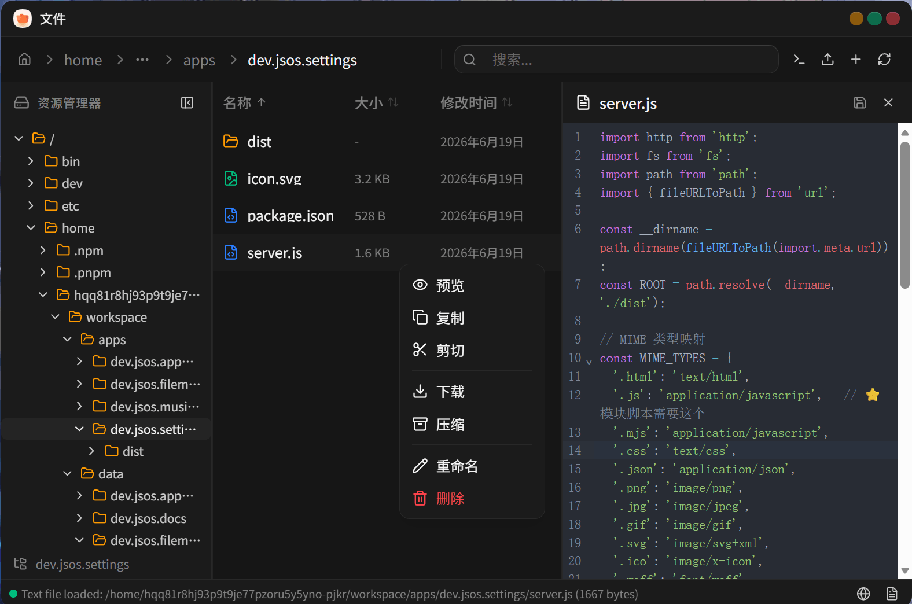

# dev.jsos.filemanager

> 文件管理器 — 基于 Web 的文件管理器，用于浏览和管理文件



浏览、编辑、上传下载文件，支持代码编辑器和桌面小组件。

## 功能

- 文件目录浏览
- 文件预览与编辑（代码编辑器，支持多语言高亮）
- 文件上传 / 下载
- ZIP 压缩包创建与解压
- 桌面小组件：共享目录统计、快速上传

## 开发

```bash
npm install
npm run dev
```

## 构建

```bash
npm run build
```

## 技术栈

- React 19
- Vite 6
- Tailwind CSS v4
- CodeMirror 6（代码编辑器）
- Express（后端服务）
